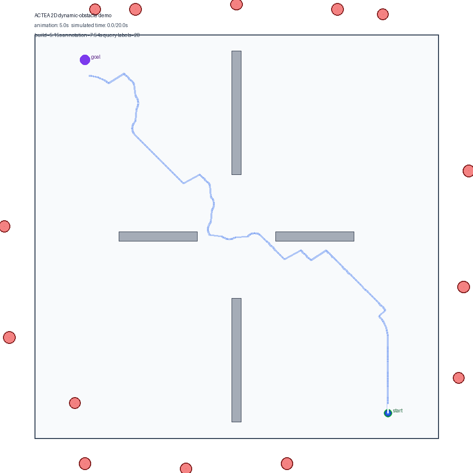

# ENPM661 Final Project

This repository implements a sampled nonholonomic temporal roadmap planner for
dynamic environments.

The main proposed method is:

```text
Sampled Nonholonomic Temporal Roadmap with ACTEA
```

where:

```text
ACTEA = Analytic Continuous-Time Edge Annotation
```

ACTEA precomputes continuous-time blocked/valid departure intervals for roadmap
edges, so repeated temporal planning queries can reuse edge-level temporal
metadata instead of repeatedly performing online dynamic collision checks.

## 2D Demo



## Paper Content Reading Order

For writing the final report, read:

1. `doc/paper_content/actea_evaluation_report_polished.md`
2. `doc/paper_content/relation_to_prior_work_and_our_extensions.md`
3. `doc/paper_content/phase3_cached_temporal_roadmap.md`
4. `doc/paper_content/actea_evaluation_report.md`
5. `doc/paper_content/t_prm_paper_notes_and_implementation_plan.md`

Implementation process notes are separated under:

```text
doc/implementation_process/
```

## Run Tests

```bash
PYTHONPYCACHEPREFIX=/tmp/codex_pycache python3 -m unittest discover -s tests -v
```

## Run Core Experiments

```bash
PYTHONPYCACHEPREFIX=/tmp/codex_pycache python3 scripts/run_experiment_actea_correctness.py
PYTHONPYCACHEPREFIX=/tmp/codex_pycache python3 scripts/run_experiment_repeated_query.py
PYTHONPYCACHEPREFIX=/tmp/codex_pycache python3 scripts/run_experiment_hard_scenes.py
PYTHONPYCACHEPREFIX=/tmp/codex_pycache python3 scripts/run_experiment_roadmap_scale_ablation.py
PYTHONPYCACHEPREFIX=/tmp/codex_pycache python3 scripts/run_experiment_heuristic_ablation.py
PYTHONPYCACHEPREFIX=/tmp/codex_pycache python3 scripts/plot_experiment_results.py
```

Generated CSV/JSON, figures, and tables are written under:

```text
outputs/experiments/
```

`outputs/` is ignored by git.

## Render a 5-Second 2D Demo Video

```bash
PYTHONPYCACHEPREFIX=/tmp/codex_pycache python3 scripts/render_actea_demo_video.py
```

Default outputs:

```text
outputs/demo/actea_2d_demo.gif
outputs/demo/actea_2d_demo.mp4
```

The demo renders one ACTEA-planned 2D query with moving circular obstacles,
static gates, the chosen path, and the robot reaching the goal.

The script uses Pillow and system `ffmpeg` if available. If `ffmpeg` is not
available, the GIF output is still generated.
